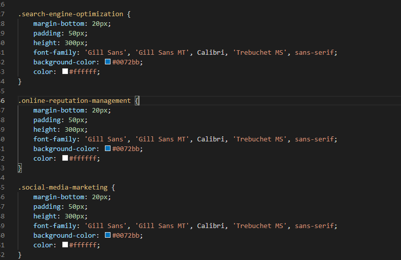

# FirstHomework

## Description 

My client asked for my company to review the code for this website and optimize it for search engines.

We reviewed their code and removed unnessecary ID tags found in some 
 elements. These included classes for the images on the website and also for some float functions of the image. The float functions have been moved to the style sheet. Also removed the Float-right style tag in the style sheet as the function was moved to the images using it.

We also noticed some of the classes listed in the style sheet are basically repeated a couple times byt used for different parts of the webpage. We may begin working on a way to combine all the classes into a sinigle on and reference it in the different elements on the website, but this will require more work than expected. Example provided below.

## Credits

https://github.com/Thaguy195/

## License

Here is where my licesnse would go if I had one.

